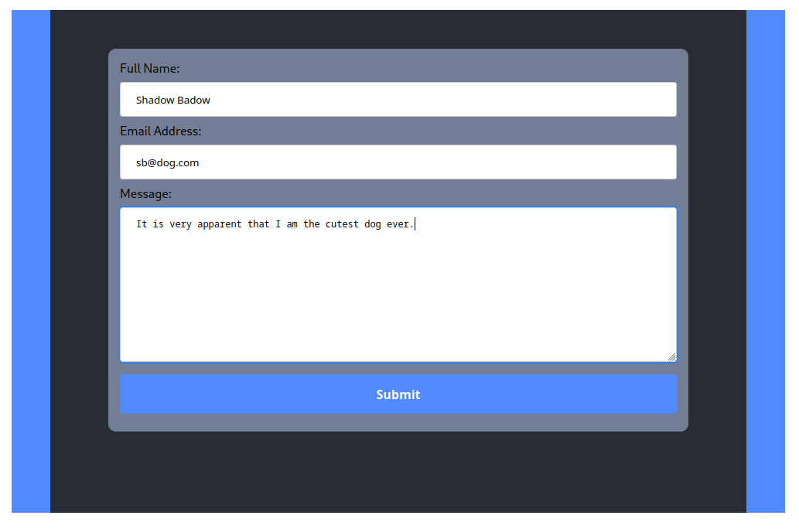

# Contact Me Form

This repo contains both the code and instructions to set-up your back end using a Faas.  
I am using AWS Lambda here    

## The Backend

Contains breif instructions on how to setup the FaaS component and mail component.

### FaaS Component

Uses AWS Lambda and AWS API Gateway.

### Mail Component

Uses AWS SES.

## The React Component

Contains the javascript and css files for a simple contact form that works with corresponding backend.  The react component has no dependencies beyond react itself, you may just copy the JavaScript and CSS into your own files and go.

